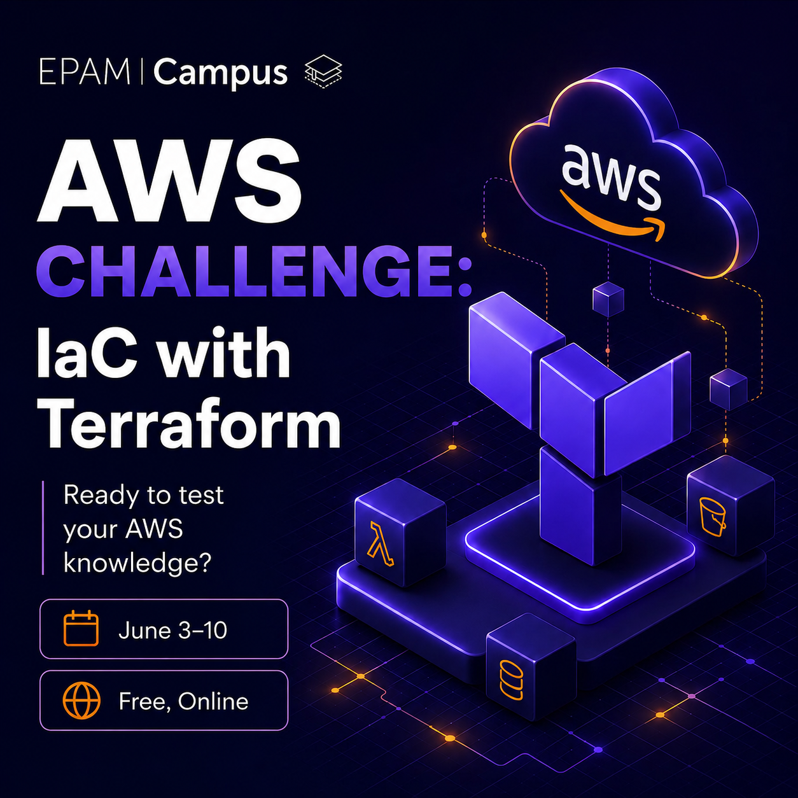

# AWS Challenge: IaC with Terraform

<p align="center">
  
</p>

This repository contains my completed solutions for the **"AWS Challenge. Competition: IaC with Terraform"** labs organized by **EPAM**. 

Each laboratory is designed as an independent module targeting specific real-world cloud engineering challenges, focusing on building secure, scalable, and highly available infrastructure on Amazon Web Services (AWS) using Infrastructure as Code (IaC) principles.

---

## Tech Stack & Best Practices

* **Cloud Provider:** Amazon Web Services (AWS)
* **IaC Tool:** HashiCorp Terraform (`>= 1.5.7`)
* **Core AWS Services:** VPC, EC2, S3, IAM, ALB, ASG
* **Strict Quality Rules Applied:**
  * **Zero Hardcoding:** All infrastructure IDs are dynamically discovered via Data Sources, shared via remote state, or configured through variables.
  * **Strong Typing:** Explicit variable definitions with mandatory type assignments and structured descriptions.
  * **Clean Code:** 100% compliant with canonical formatting (`terraform fmt`) and rigorous semantic checks (`terraform validate`).

---

## Challenge Tasks

* [Lab 01: Creating Network Resources](./lab01-vpc-network) – Constructing an isolated custom Virtual Private Cloud (VPC) with multi-AZ public subnets, an Internet Gateway, and traffic routing.
* [Lab 02: Resources for SSH Authentication](./lab02-ec2-ssh-auth) – Safely registering custom public keys and deploying public EC2 instances linked with pre-created security groups via Data Sources.
* [Lab 03: Object Storage Deployment](./lab03-s3-object-storage) – Provisioning highly secure, globally unique, and strictly private Amazon S3 buckets.
* [Lab 04: Creating IAM Resources](./lab04-iam-resources) – Implementing the Principle of Least Privilege (PoLP). Deploying template-driven custom IAM Policies (JSON), assuming trusted relationships for EC2, and setting up Instance Profiles.
* [Lab 05: Configuring Network Security](./lab05-network-security) – Isolating public and private application subnets. Restricting internal ingress flow using explicit `source_security_group_id` constraints instead of open CIDR block configurations.
* [Lab 06: Form TF Output](./lab06-tf-outputs) – Designing an infrastructure baseline delivering robust tracking arrays (`outputs.tf`) for downstream automation consumption.
* [Lab 07: Configure a Remote Data Source](./lab07-remote-data-source) – Establishing cross-cutting state synchronization workflows using the `terraform_remote_state` construct to safely fetch Landing Zone outputs from S3.
* [Lab 08: Application Instances behind a Load Balancer](./lab08-alb-asg) – Implementing auto-healing architectures. Interconnecting an Application Load Balancer (ALB) with an Auto Scaling Group (ASG) and dynamically retrieving server metrics via IMDSv2 user-data.
* [Lab 09: Use Data Discovery](./lab09-data-discovery) – Eliminating explicit state file linking. Abstracting infrastructure discovery via flexible tag filtering (`tag:Name`) and regex matching for deploying the latest AMIs.
* [Lab 10: Move Resources between State Files](./lab10-state-migration) – State refactoring patterns. Decoupling core state ownership blocks across independent root modules without affecting or dropping running cloud assets via `terraform state mv`.
* [Lab 11: Blue-Green Deployment with Traffic Routing](./lab11-blue-green-deployment) – Advanced deployment strategies. Coordinating zero-downtime micro-release patterns by engineering weighted target group traffic distribution on an ALB.

---

## Deployment & Execution Instructions

> **Note for reviewers:** The instructions below describe how each independent lab module can be deployed and tested locally.

### 1. Environment & Variable Configuration
Before attempting to initialize or execute any module, all environment-specific target parameters must be defined inside the `terraform.tfvars` file of that specific laboratory folder:
* Review and customize input variables such as IP ranges, region configurations, and naming prefixes.
* **Important:** Multiple lab challenges are dependent on **pre-created cloud environments** provided by the challenge platform (such as existing baseline VPCs, landing zones, or dedicated security group boundaries). To ensure successful deployment, proper platform resource identifiers must be mapped inside your local `terraform.tfvars` file before starting.

### 2. Terraform Lifecycle Workflow
Navigate into the chosen laboratory directory and trigger the canonical execution sequence:

```bash
# 1. Initialize the directory and download required provider plug-ins
terraform init

# 2. Rewrite configuration files to canonical format and style
terraform fmt

# 3. Validate the configuration files for structural and syntactic correctness
terraform validate

# 4. Create an execution plan to preview infrastructure modifications
terraform plan

# 5. Execute the actions focused on provisioning real-world AWS assets
terraform apply

# 6. Destroy all infrastructure managed by the current Terraform configuration (execute only after all verifications are complete)
terraform destroy
